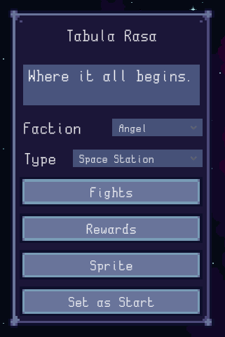

# Campaigns
Campaigns (Galaxy maps) are created using an editor within the game itself, accessed from the title screen's "Campaign Editor" button.

## Editor
The campaign editor's main screen is simple; you can pan the view with middle-click and select locations (nodes) with left-click. More locations can be added with the button at the top.


When a node is selected, you can drag it with left-click to move it around. You can middle-click other nodes to connect them together. You will also get a panel on the left side where you can edit the node:



You can edit the name of the location by clicking it. The box below is the description that appears in tooltips.

Faction determines the enemies that will spawn in fights on that node, for randomly-generated fights.

The type dropdown determines the sprite set for the location. You can change the icon from the "Sprite" button.

The rewards button takes you to a menu where you can set the rewards for conquering the location: ship unlocks, chunks, extra fleet size, lunchboxes, production boosts or any non-Ascension upgrade.

The "Set as start" button is used to set the starting point of the Galaxy map - the location that is conquered by default.

The fights button leads to a menu where you can customize the combats of the node. "Level scaling" determines how many levels enemies get after each fight. "Fights" is the total amount of combats the player needs to win to conquer the node. "Extra enemy spawning point budget" increases the amount of random enemies per fight.


Enemies in fights are randomly picked by default, but you manually create encounters with the "Add" button at the bottom. This takes you to a menu where you can add enemies from a dropdown. The number field on the left of each custom fight is the index (starting from 0) of the fight that the encounter will take place on. Ex. 1 takes place on the second fight at the node.


At the top of the screen you can access a page with numerous options affecting the whole campaign, such as the starting ship and some constants for formulas. You can also choose to make upgrades unavailable for purchase; this is useful if you want to make an upgrade be obtainable only from conquest, or not at all.

## Custom Ascension Tree
You can create custom Ascension trees for campaigns; see the [Ascension](ascension.md) page.

## Default Boost
When the game calculates the player's total [boosts](boosts.md), it does so starting with a "default boost" to which all others are summed up.

You can define a custom default boost for your campaign to modify the player's starting stats and unlocked features by creating a Json file with the same filename as the campaign, but `.defaultboost` as the extension.

This file should otherwise follow the [boost](boosts.md) format.

This boost *does not* use values from the vanilla one for unspecified fields, meaning that there are some important fields that you should not forget to define, such as `buildingUnlocks` and `baseStrastChance` - else the player will not be able to build anything nor find any Strange Asteroids! TODO document the vanilla default boost.

Example: makes the player start with +100% Metal production, the same 3 unlocked buildings as in vanilla, 1% base Strange Asteroid chance, as well as all cooking tiers and keyboard mining unlocked.

```json
{
	"resourceProductionBoosts": [
		{
			"resourceId": 0,
			"multiplier": 1
		}
	],
	"buildingUnlocks": ["metal_mine", "research_lab", "solar_panel"],
	"baseStrastChance": 0.01,
    "cookingTier1": true,
	"cookingTier2": true,
	"cookingTier3": true,
	"keyboardClicking": true
}
```