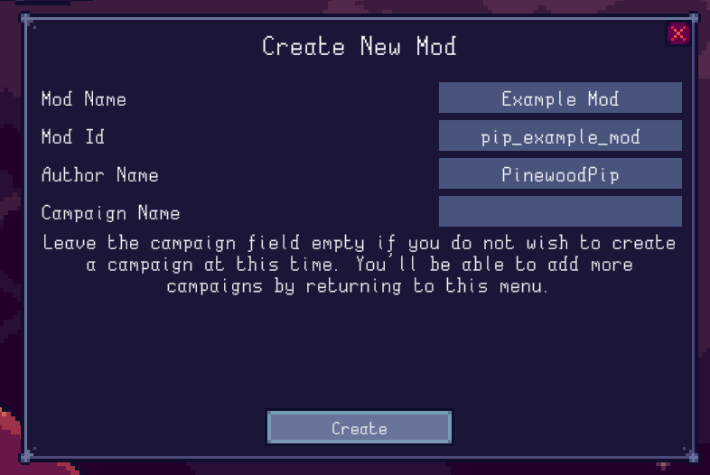

# Lazy Galaxy 2 Modding Docs

## Introduction
This site serves as a guide and reference to creating custom content for Lazy Galaxy 2.

At the time of writing, mods can add new campaigns, upgrades, ships, ship abilities, food items, recipes and Ascension trees.

You can load multiple mods at once, however enabling a mod on a savefile is a one-way trip; once enabled, the savefile will not load without the mod being installed. You will be notified of this when you try to load a savefile with new mods enabled, and a backup of the save will be created in case you need to revert.

When creating mods, you should use separate saves for testing (or a copy of your normal one) in case things go wrong.

## Setup
The easiest way to create a mod is through the campaign editor option in the mods menu (accessed from the main menu):

Even if you don't intend to create a custom campaign, the menu is useful as it will create a mod project folder with all the metadata already written, so you do not need to set it all up manually.

Make sure to make the ID field as unique as possible (including your name as a prefix/suffix helps a lot) to avoid conflicts with other mods as this will be used to identify your mod's stuff in savefiles. **As such, it should not be changed, ever.**

Once you press create, a folder will be created in your savefile folder (`\AppData\LocalLow\ColdwildGames\Lazy Galaxy 2\Mods\` on Windows) and you'll be ready to start creating content. If you chose to create a campaign, you will be brought into the campaign editor.

## File format
[Campaigns](campaigns.md) are binary files, editable through the in-game campaign editor. All other custom content is defined through `.json` files, the properties and structure of each being explained in the various sections of these docs.

JSON is a simple, easy to write and easy to read format inspired by JavaScript objects. You can quickly read up on its syntax [here](https://www.tutorialspoint.com/json/json_syntax.htm).

All modded content must have a string ID, used to refer to the content in savefiles and other assets of your mod. These IDs should be unique across all content in your mod, and internally are automatically prefixed with your mod's ID to avoid conflicts, meaning it is redundant for you to prefix/suffix them yourself.

**It is never safe (for existing savefiles) to remove content from a mod, or change IDs of things.** If you wish to remove something, you should hide/make it unavailable instead, otherwise you risk making current saves that use your mod unusable. The sections for each type of modded item mention how to do so (if possible). Changing any other property is fine unless otherwise specified.

Unless otherwise specified, properties in the `.json` files default to `0`/`false`/`""` (empty string) depending on the type.

## Folder structure
A mod contains the following folders and files:

- `meta.json`: contains mod metadata, like the mod's name, your author name, and version (used for parsing old mods in case of format changes in future game updates)
- `icon.png`: the icon for the mod; will be shown on the workshop website as the banner for the mod. Must be under 1MB.
- `Abilities`: contains files defining ship abilities.
- `Campaigns`: contains campaign files; these are binary, they can only be edited in-game. Can also contain an Ascension tree for each campaign.
- `Food`: contains food items.
- `Language`: contains `.xml` files with custom text strings for use in other files (ex. ship and upgrade names/descriptions)
- `Recipes`: contains cooking recipes.
- `Ships`: contains ships.
- `Sprites`: contains sprites, as `.png`s.
- `Upgrades`: contains upgrades.
- `Boosts`: contains boosts, which define the effects of upgrades and food items.

You needn't to include assets of all types, however some require the use of others. Ships require Abilities, while Food and Upgrades require Boosts.

Head over to one of the sections on the sidebar to get started! It's recommended to take a look at the [example mod](example_mod.zip)  as reference.